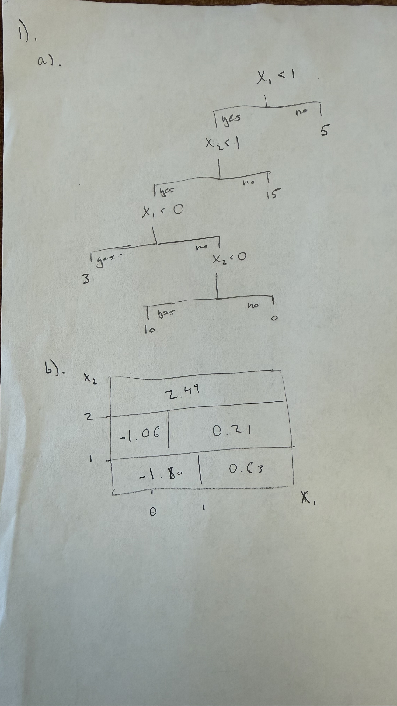

```{r setup, include=FALSE}
knitr::opts_chunk$set(echo = TRUE)
```

# Problem 1: Decision Trees

## (a) 

See Figure 1. Sketch the tree corresponding to the partition of the predictor space illustrated
on the left-hand side of Figure 1. The numbers inside the boxes indicate the mean of Y within
each region.

```{r}



```

## (b) 

See Figure 1. Create a diagram showing how the predictor space is partitioned (similar to the
left-hand size of Figure 1) based on the tree on the right-hand side of Figure 1. You should
divide up the predictor space into the correct regions, and indicate the prediction of Y for
each region.

[FIGURE]

Use the OJ data set, which is part of the ISLR2 package, for this problem.

```{r}


```

## (c) 

Create a training set containing a random sample of 800 observations, and a test set containing
the remaining observations.


``` {r}

library(ISLR2)

set.seed(1)

n <- nrow(OJ)
train <- sample(1:n, 800, replace = FALSE)
test <- setdiff(1:n, train)


```

## (d) 

Fit a tree to the training data with Purchase as the response and the other variables as
predictors. For this dataset, use deviance as your split criteria. Produce summary statistics
about the tree (using the summary() function) and describe the results obtained. What is
the training error? How many terminal nodes does the tree have?

```{r}

#install.packages("tree")
library(tree)

tree_oj <- tree(Purchase ~ ., data = OJ, subset = train, split = "deviance")

summary(tree_oj)

```

## (e) 

Create a plot of the tree, and interpret the results.


```{r}

plot(tree_oj)
text(tree_oj)

```

## (f) 

Predict the response on the test set and report the confusion matrix.


```{r}

tree_pred <- predict(tree_oj, OJ[test, ], type = "class")
conf_matrix <- table(Predicted = tree_pred, Actual = OJ$Purchase[test])
print(conf_matrix)

test_error <- 1 - mean(tree_pred == OJ$Purchase[test])
cat("Test Error Rate:", test_error)

```

## (g) 

Apply cv.tree() to determine the optimal tree size. Do this carefully to prevent double-
dipping. Produce a plot with tree size on the x-axis and cross-validated classification error
rate on the y-axis.

```{r}

set.seed(1)
cv_oj <- cv.tree(tree_oj, FUN = prune.misclass)

plot(cv_oj$size, cv_oj$dev, type = "b", 
     xlab = "Tree Size", ylab = "CV Classification Error")

```

## (h) 

What tree size corresponds to the lowest cross-validated classification error rate? If cross-
validation does not lead to selection of a pruned tree, then create a pruned tree with five
terminal nodes.


```{r}

best_size <- cv_oj$size[which.min(cv_oj$dev)]
cat("Optimal Tree Size:", best_size)

prune_oj <- prune.misclass(tree_oj, best = 5)
summary(prune_oj)

```

## (i) 

Compare the training error rates between the pruned and un-pruned trees. Which is higher?
Is this what you expect? Explain.

The un-pruned tree will have a lower training error because it is more flexible.

## (j) 

Compare the test errors rates between the pruned and un-pruned trees. Which is higher? Is
this what you expect? Explain.

The pruned tree should have a lower test error because it has lower variance and doesn't overfit the training noise.


# Problem 2: Bagging and Random Forests

We’ll use the Carseats for this problem; it is part of the ISLR2 library. Convert Sales to a
qualitative response, the same way we did in class.

## (a) 

Split the data set into a training and test set.

``` {r}

set.seed(1)

High <- factor(ifelse(Carseats$Sales <= 8, "No", "Yes"))
Carseats_Data <- data.frame(Carseats, High)

train <- sample(1:nrow(Carseats_Data), 200)
test <- setdiff(1:nrow(Carseats_Data), train)
Carseats_test <- Carseats_Data[test, ]


```

## (b) 

Fit a classification tree to the training set. Use gini index as your splitting criteria. Plot the
tree here and interpret the results. Report your training and test error.

```{r}
set.seed(1)
tree_carseats <- tree(High ~ . - Sales, data = Carseats_Data, subset = train, split = "gini")

plot(tree_carseats)
text(tree_carseats, pretty = 0)

train_pred <- predict(tree_carseats, Carseats_Data[train, ], type = "class")
test_pred <- predict(tree_carseats, Carseats_test, type = "class")

train_err <- mean(train_pred != Carseats_Data$High[train])
test_err <- mean(test_pred != Carseats_test$High)

cat("Train Error:", train_err, "\nTest Error:", test_err)

```
Interpretation: Test error and training error above. One thing I notice about this tree is that it is quite deep.

## (c) 

Implement cross-validation to obtain the optimal level of tree complexity. What size tree is
optimal? What is the test error for the pruned tree?

```{r}

set.seed(1)
cv_carseats <- cv.tree(tree_carseats, FUN = prune.misclass)

plot(cv_carseats$size, cv_carseats$dev, type = "b", xlab = "Tree Size", ylab = "CV Error")

best_size <- cv_carseats$size[which.min(cv_carseats$dev)]

prune_carseats <- prune.misclass(tree_carseats, best = best_size)
prune_pred <- predict(prune_carseats, Carseats_test, type = "class")
prune_test_err <- mean(prune_pred != Carseats_test$High)

cat("Optimal Size:", best_size, "\nPruned Test Error:", prune_test_err)

```

## (d) 

Implementing bagging on the training set. Set B = 500, where B is the number of trees.
What test error do you obtain? Use the importance() function to determine which variables
are the most important and report them here.


```{r}

library(randomForest)
set.seed(1)
bag_carseats <- randomForest(High ~ . - Sales, data = Carseats_Data, 
                             subset = train, mtry = 10, ntree = 500, importance = TRUE)

bag_pred <- predict(bag_carseats, newdata = Carseats_test)
cat("Bagging Test Error:", mean(bag_pred != Carseats_test$High))
cat("\n")

importance(bag_carseats)
varImpPlot(bag_carseats)

```

## (e) 

Implement random forests on the training. Experiment with different values of m (m =
1, 2, 3, . . . , 10) and report the test error for different values of m in a table.

```{r}

m_values <- 1:10
rf_results <- data.frame(m = m_values, Test_Error = NA)

for (m in m_values) {
  rf_temp <- randomForest(High ~ . - Sales, data = Carseats_Data, 
                          subset = train, mtry = m, ntree = 500)
  rf_pred <- predict(rf_temp, newdata = Carseats_test)
  rf_results$Test_Error[m] <- mean(rf_pred != Carseats_test$High)
}
print(rf_results)

```

## (f) 

Looking at your table from part (e), would it be appropriate to choose the m that gives us
the smallest test error? Explain. (Hint: the answer is no.)

No because that is being trained on test data which is unfair and will not reflect on truly unseen data.


## (g) 

Technically m is a tuning parameter. Implement a data-driven approach to decide on the
appropriate m. Report that value here.


```{r}

oob_errors <- numeric(10)
for (m in 1:10) {
  fit <- randomForest(High ~ . - Sales, data = Carseats_Data, 
                      subset = train, mtry = m)
  oob_errors[m] <- fit$err.rate[500, "OOB"]
}

best_m_oob <- which.min(oob_errors)
cat("The appropriate m based on OOB error is:", best_m_oob)

```


